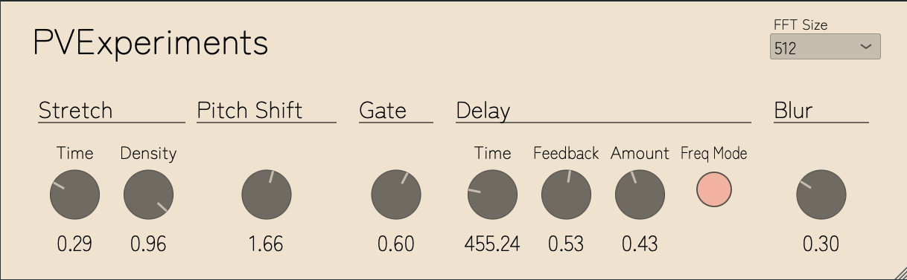

# PVExperiments

A VST/AU plugin built with the JUCE framework. Originally intended as a phase vocoder implementation, the project grew into a small spectral processing framework incorporating several experimental effects.




## Building

Clone the repository with submodules:
```git clone --recursive https://github.com/Bohr33/PVExperiements```

Configure and build:

```
cmake -B build  
cmake --build build --config Release

```

Built plugin artifacts will be located in `build/PVExperiments_artefacts/Release/`.

### Formats
- **VST3** — compatible with most DAWs
- **AU** — macOS only

## Effects

Audio is processed through five stages in series:

** Spectral Stretch → Pitch Shift → Gate → Spectral Delay → Spectral Blur**

### Spectral Stretch
This was an experiment after implementing the blur and delay effects. Both hold and process spectral frame buffers; stretch takes a similar approach but reads through the buffer based on a set length (TIME) and rate (DENSITY).

### Pitch Shift
This is a standard pitch shifting effect. It takes spectral frame buffers and uses the pitch shift value to scale the spectral frame buffers bin datas up or down.

### Gate
This was another experiment with the goal of eliminating some of the spectral noise. Applies a gate to spectral bin data, zeroing amplitude values below a set 
threshold in each spectral frame. The result functions similarly to a 
high-pass filter, attenuating low-amplitude spectral content across the buffer.

### Spectral Delay
Spectral Delay operates like a conventional delay, but processes spectral 
frames rather than time-domain audio. By default, only amplitude bins are 
delayed; enabling **Freq Toggle** extends the delay to the phase-difference 
bins as well. Delaying amplitude bins alone produces a subtle timbral 
difference compared to a standard delay, while enabling **Freq Toggle** 
has a more pronounced and experimental effect on the output.

### Spectral Blur
Spectral Blur essentially smears the frequencies of the audio by holding the spectral frames in a buffer and averaging the values of both the amplitude and frequency bins. The blur amount is an arbitrary range dependedant on the max frame size, currently `300`. Because its dependant on the frame size only, the effect will change based on `FFTSize`.

**Note:** If you want to change the effect processing order, simply rearrange the effect processing functions in the AudioProcessor `processBlock()` function.

## Controls

### Main parameters

| Parameter | Description | Range |
|---|---|---|
| Pitch Shift | Pitch shift multiplier | 0.0 – 3.0 |
| Blur Amount | Window length (Max 300 frames) over which spectral frames are averaged | 0.0 - 1.0 |
| Spectral Time | Duration for which frames are held in the stretch buffer | 0.0 - 1.0 |
| Spectral Density | Density of frames played back during the **Spectral Time**| 0.0 - 1.0 |
| Gate Amount | Amplitude threshold below which bin values are zeroed | 0.0 - 1.0 |
| Delay Time | Spectral delay time in milliseconds | 1.0 - 2,000 ms |
| Delay Amount | Spectral delay output gain | 0.0 - 1.0 |
| Feedback | Delay feedback amount (clamped to 0.99) | 0.0 - 0.99 |


### Additional controls

- **FFT Size** — dropdown to select between three FFT sizes. Larger FFT Size performs a higher quality analysis, but at the cost of increased CPU usage.
- **Frequency Delay Toggle** — when enabled, delay is also applied to the phase difference bins of the PV frames.

## Implementation

### Phase vocoder

The phase vocoder performs an STFT and produces a custom `Fsig` structure holding per-bin amplitude and frequency values as vectors of length `FFT size / 2 + 1`. Internal buffers are managed as `std::vector`s and resized in `prepare()`, which handles changes to buffer size, FFT size, and sample rate. The phase vocoder owns instances of each spectral processor and calls their `prepare()` and `process()` functions at the appropriate points.

### Spectral processors

Each spectral processor is a relatively lightweight class implementing its own `prepare()` and `process()` functions. The spectral stretch processor originated as a time-stretching algorithm using a circular buffer of input frames read back at a different rate. This proved problematic for real-time use, so the design was changed: a buffer of frames is held for a duration set by the stretch time parameter, and frames are read from it at a density determined by the density parameter — producing a granular-style smearing effect rather than true time stretching.

### Parameters and threading

Parameters are declared in a `juce::AudioProcessorValueTreeState` in the processor class and passed to the phase vocoder. Values are stored as atomics and loaded at the top of each frame process to ensure thread safety.

## Performance notes

CPU usage is significant, particularly for stereo processing and large FFT sizes. I've only had real buffering issues with FFT size = 2048, and with the blur and stretch parameters using high parameters. These effects use Fsig buffers for processing, and the higher parameter values necessitate processing more buffers per processing block.
